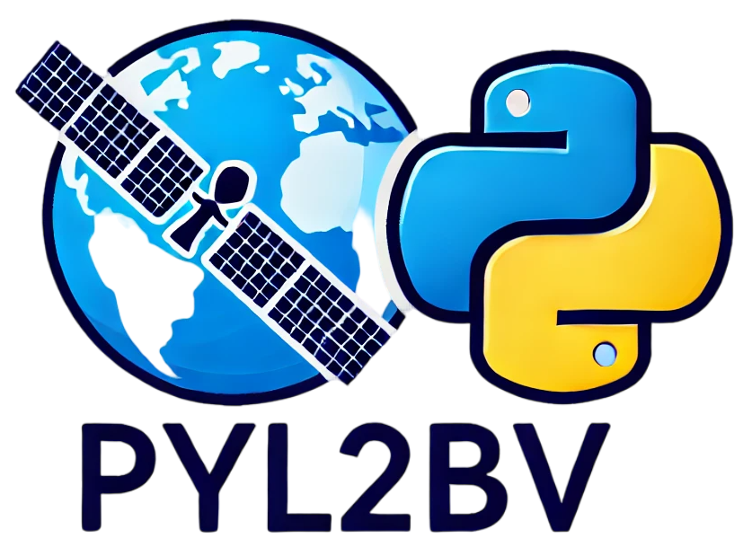
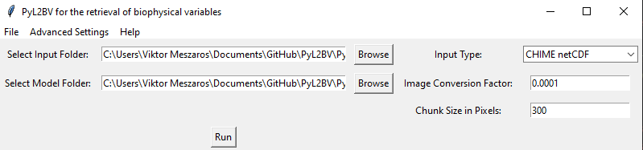
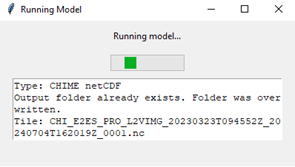
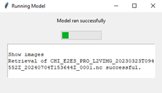
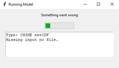

 

# PyL2BV
 Next implementation of my Master Thesis, 
 the BioRetrieval PyL2BV program,
 which stands for Python Level 2B Vegetation.

# Installation Guide

## Prerequisites

Ensure you have Python 3.10.12 installed on your system.

## Creating a Virtual Environment

### Using `venv`

1. Create a virtual environment:
    ```bash
    python -m venv myenv
    ```
2. Activate the virtual environment:
    - On macOS/Linux:
        ```bash
        source myenv/bin/activate
        ```
    - On Windows:
        ```powershell
        .\myenv\Scripts\activate
        ```

### Using `conda`

1. Create a new conda environment:
    ```bash
    conda create --name myenv python=3.10.12
    ```
2. Activate the conda environment:
    ```bash
    conda activate myenv
    ```

## Installing Packages

Once you have activated your virtual environment, install the necessary packages from `requirements.txt`:

```bash
pip install -r requirements.txt
```

# GUI Usage



The GUI allows the user to set the following parameters:
- **Input Folder:** Select the folder containing the input files.
- **Model Folder:** Choose the folder with the required model files.
- **Input Type:** Specify the type of input (options include "CHIME netCDF" and "ENVI Standard").
- **Conversion Factor:** Set the image conversion factor as needed.
- **Advanced Settings:** The "Plotting results" option can be toggled in this dropdown.

# Program Running

When the "Run" button is pressed, the program begins retrieval and opens a progress window for tracking.



# Outcomes

Below are examples of outcome images generated by the program:

 

After the progress window closes, the user can initiate another retrieval directly from the GUI.

