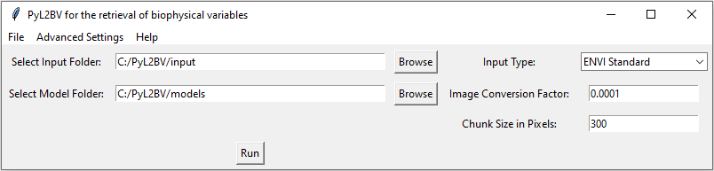

 

# PyL2BV
  The PyL2BV (Python Level 2B Vegetation) package is for running
  ARTMO (https://artmotoolbox.com/) based GPR (Gaussian Process Regression)
  models on Hyperspectral images.

## Installation Guide

## Prerequisites

Ensure you have Python 3.10.12 installed on your system.

You can install the package directly from GitHub using pip:

```sh
pip install git+https://github.com/mv-xion/PyL2BV.git
```

## Creating a Virtual Environment

### Using `venv`

1. Create a virtual environment:
    ```bash
    python -m venv myenv
    ```
2. Activate the virtual environment:
    - On macOS/Linux:
        ```bash
        source myenv/bin/activate
        ```
    - On Windows:
        ```powershell
        .\myenv\Scripts\activate
        ```

### Using `conda`

1. Create a new conda environment:
    ```bash
    conda create --name myenv python=3.10.12
    ```
2. Activate the conda environment:
    ```bash
    conda activate myenv
    ```

## Installing Side-Packages

Once you have activated your virtual environment, install the necessary packages from `requirements.txt`:

```bash
pip install -r requirements.txt
```

## CLI Usage

### Using the Python API

To run a model using the Python API, you can use the `run_pyl2bv.py` script. Below is an example of how to use it:

```python
from PyL2BVcli.model_runner import run_retrieval

# Define the input folder path
input_folder_path = "/path/to/your/input_folder"

# Define the input type (assuming it's a required argument)
input_type = "CHIME netCDF"

# Define the model folder path
model_name = "/path/to/your/model_folder"

# Define the conversion factor (example value, replace with actual if needed)
conversion_factor = 0.0001

# Run the model
run_retrieval(
    input_folder_path=input_folder_path,
    input_type=input_type,
    model_folder_path=model_path,
    conversion_factor=conversion_factor,
    plot=False,
)
```

### Using the Command-Line Interface (CLI)

You can also run the model using the command-line interface. Below is an example of how to use it:

```sh
python -m PyL2BVcli.cli /path/to/your/input/folder "CHIME netCDF" /path/to/your/model/folder 0.0001 --plot
```

The CLI accepts the following arguments:

- `input_folder_path`: Path to the input folder
- `input_type`: Type of input file
- `model_folder_path`: Path to the model folder
- `conversion_factor`: Image conversion factor
- `--plot`: Optional flag to enable plotting

## GUI Usage



The GUI allows the user to set the following parameters:
- **Input Folder:** Select the folder containing the input files.
- **Model Folder:** Choose the folder with the required model files.
- **Input Type:** Specify the type of input (options include "CHIME netCDF" and "ENVI Standard").
- **Conversion Factor:** Set the image conversion factor as needed.
- **Advanced Settings:** The "Plotting results" option can be toggled in this dropdown.

### Program Running

When the "Run" button is pressed, the program begins retrieval and opens a progress window for tracking.


### Outcomes

Below are examples of outcome images generated by the program:

 

After the progress window closes, the user can initiate another retrieval directly from the GUI.

## License

This project is licensed under the MIT License - see the [LICENSE](LICENSE) file for details.


